# 🖼️ PPE Safety Monitor - Screenshot Gallery

A visual tour of the PPE Safety Monitor application.

---

## 🎮 Interface Overview

<table>
  <tr>
    <td width="50%">
      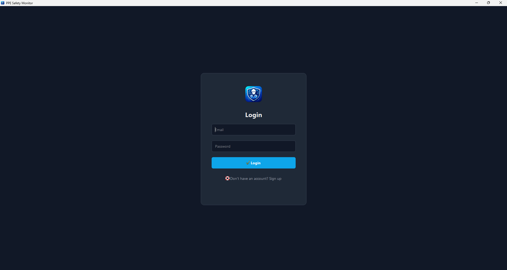
      <br/>
      <b>Login In App</b>
      <br/>
      <i>Enter Your Register Email And password</i>
    </td>
    <td width="50%">
      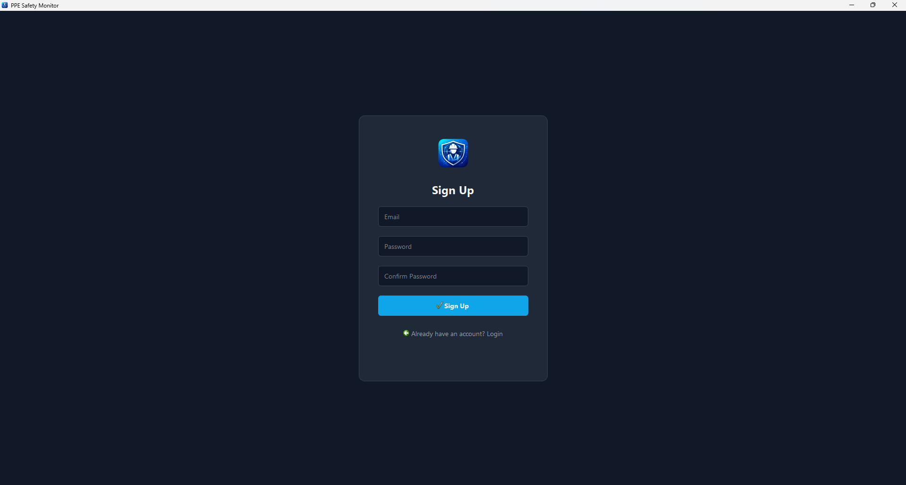
      <br/>
      <b>Register In App</b>
      <br/>
      <i>Enter Your Email And password And Confirm It And Check Your Mail For Verification</i>
    </td>
  </tr>
  <tr>
    <td width="50%">
      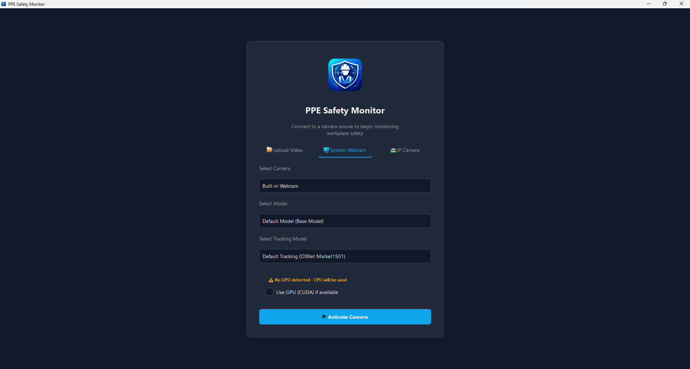
      <br/>
      <b>Connection Setup</b>
      <br/>
      <i>Choose your camera source and configure models</i>
    </td>
    <td width="50%">
      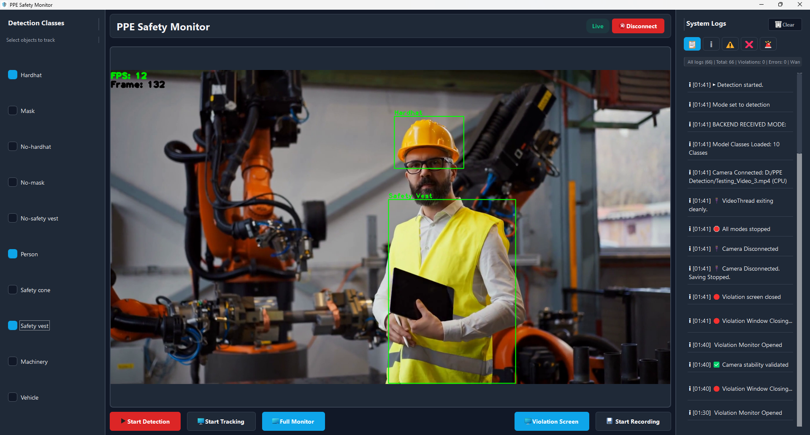
      <br/>
      <b>Detection Mode</b>
      <br/>
      <i>Real-time object detection with customizable classes</i>
    </td>
  </tr>
  <tr>
    <td width="50%">
      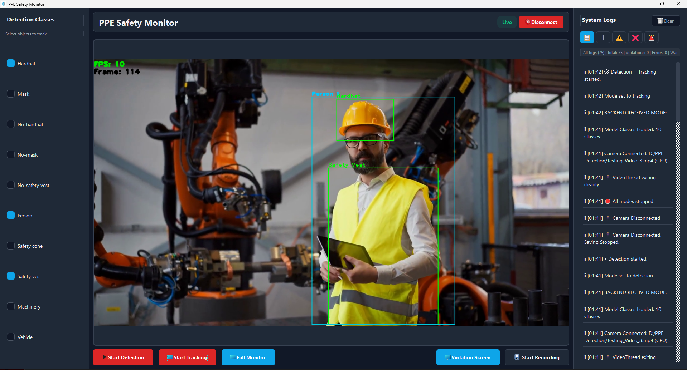
      <br/>
      <b>Tracking Mode</b>
      <br/>
      <i>Multi-person tracking with persistent IDs</i>
    </td>
    <td width="50%">
      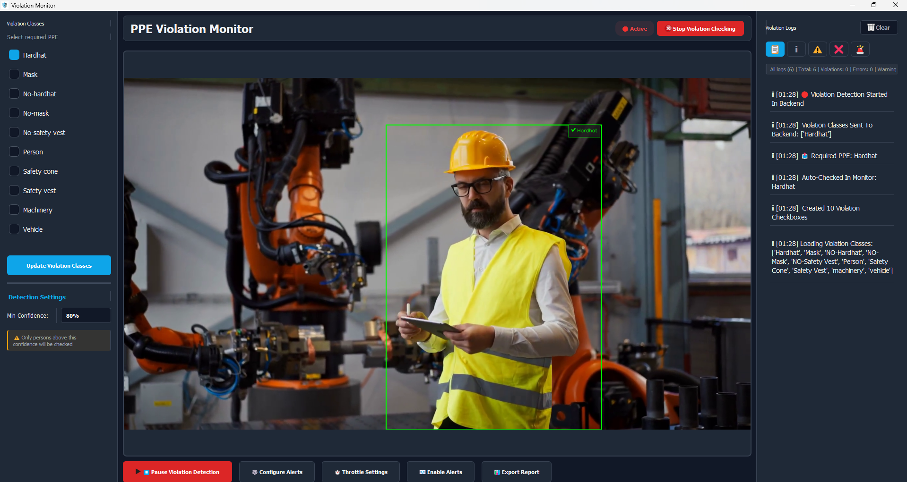
      <br/>
      <b>Violation Monitor</b>
      <br/>
      <i>Dedicated PPE compliance monitoring interface</i>
    </td>
  </tr>
</table>

---

## 🚨 Violation Detection

<table>
  <tr>
    <td width="50%" align="center">
      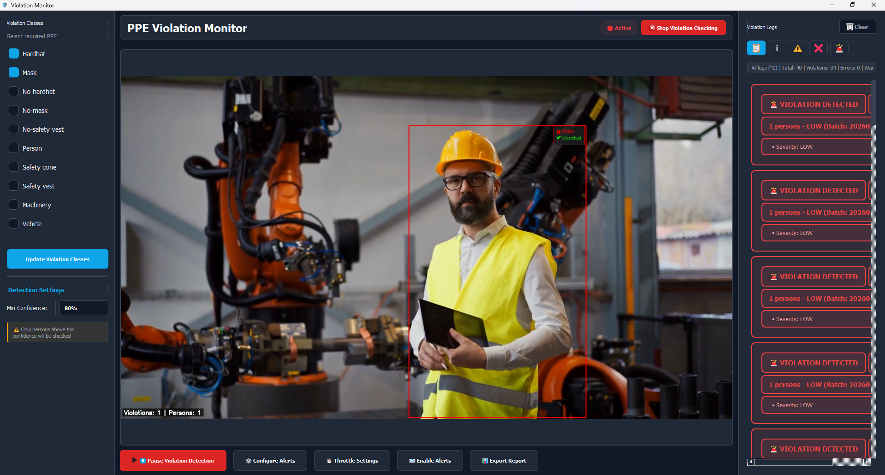
      <br/><br/>
      <b>❌ Violation Detected</b>
      <br/>
      <i>Red borders indicate missing PPE with detailed breakdown</i>
    </td>
    <td width="50%" align="center">
      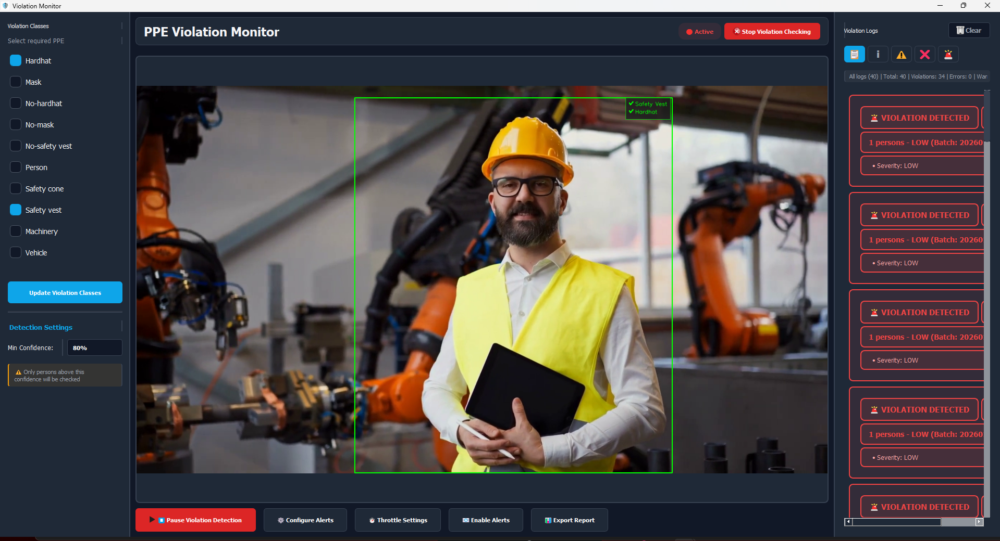
      <br/><br/>
      <b>✅ Compliant Worker</b>
      <br/>
      <i>Green indicators confirm proper PPE usage</i>
    </td>
  </tr>
</table>

---

## 📧 Alert System

<div align="center">
  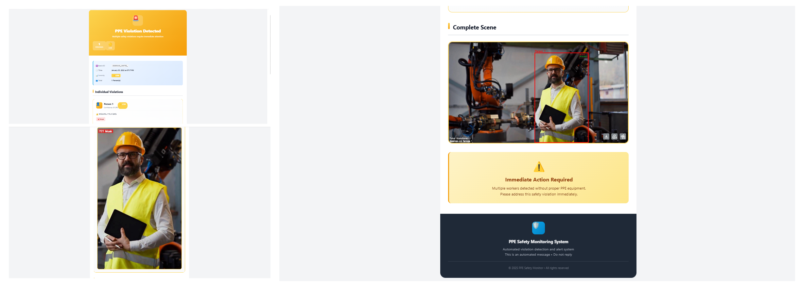
  <br/><br/>
  <b>Professional Email Alerts</b>
  <br/>
  <i>Automated notifications with violation details and images</i>
</div>

<br/>

<div align="center">
  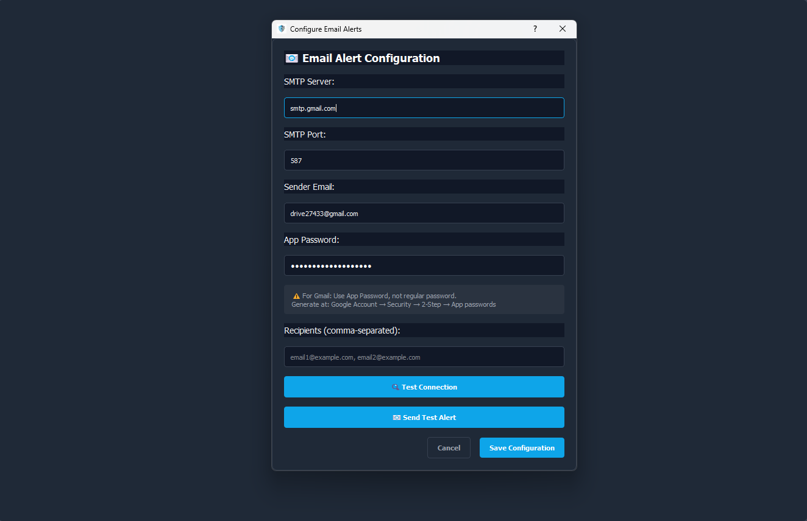
  <br/><br/>
  <b>Easy Configuration</b>
  <br/>
  <i>Simple SMTP setup with test functionality</i>
</div>

---

## 📊 Monitoring & Logging

<div align="center">
  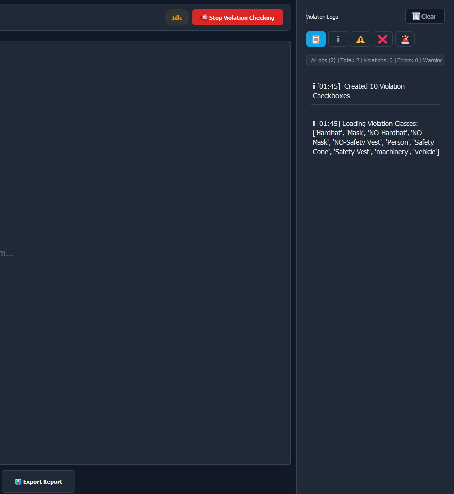
  <br/><br/>
  <b>Comprehensive Logging System</b>
  <br/>
  <i>Real-time logs with filtering, statistics, and export capabilities</i>
</div>

---

## ⚡ Full Monitor Mode

<div align="center">
  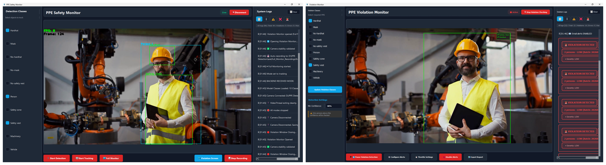
  <br/><br/>
  <b>All-in-One Safety Dashboard</b>
  <br/>
  <i>Detection, tracking, violation monitoring, and recording - all active simultaneously</i>
</div>

---

## 🎨 Key Features Highlighted

<table>
  <tr>
    <td width="33%" align="center">
      <h3>🎯 Real-time Detection</h3>
      <p>Instant object recognition with adjustable confidence thresholds</p>
    </td>
    <td width="33%" align="center">
      <h3>👥 Person Tracking</h3>
      <p>Persistent IDs across frames using StrongSORT algorithm</p>
    </td>
    <td width="33%" align="center">
      <h3>🛡️ PPE Monitoring</h3>
      <p>Comprehensive safety equipment compliance checking</p>
    </td>
  </tr>
  <tr>
    <td width="33%" align="center">
      <h3>📧 Smart Alerts</h3>
      <p>Throttled email notifications with batch processing</p>
    </td>
    <td width="33%" align="center">
      <h3>💾 Auto-Recording</h3>
      <p>Automatic video/frame capture during violations</p>
    </td>
    <td width="33%" align="center">
      <h3>📊 Analytics</h3>
      <p>Detailed logs and exportable compliance reports</p>
    </td>
  </tr>
</table>

---

## 🎥 Demo Videos (Optional)

If you create demo videos, embed them here:

```markdown
### Quick Start Guide
[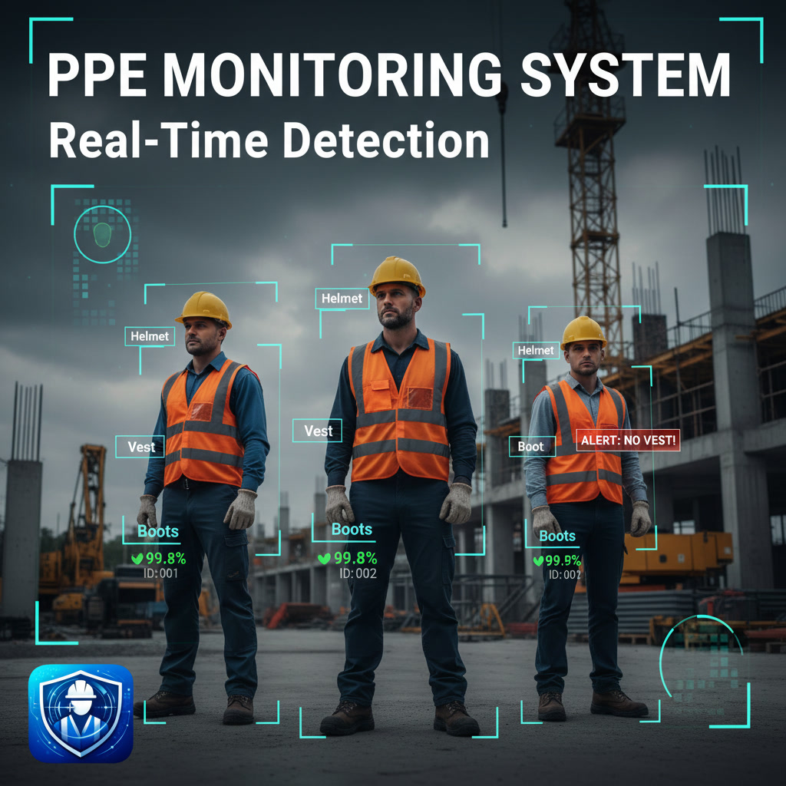](https://www.youtube.com/watch?v=AlRjiE3LIQQ)

▶️ Click the image to watch the full PPE Monitoring System demo on YouTube.

```

---


## 🎨 UI/UX Design

### Color Scheme
- **Primary**: `#0ea5e9` (Sky Blue)
- **Background**: `#111827` (Dark Gray)
- **Cards**: `#1f2937` (Slate)
- **Success**: `#10b981` (Green)
- **Warning**: `#F59E0B` (Orange)
- **Danger**: `#ef4444` (Red)

### Typography
- **Font**: Segoe UI, sans-serif
- **Sizes**: 12px - 24px
- **Weights**: Normal, Bold

---

## 📏 Technical Specifications

| Component | Technology |
|-----------|-----------|
| Detection | YOLOv11 (Ultralytics) |
| Tracking | StrongSORT |
| GUI | PyQt5 |
| Backend | OpenCV + PyTorch |
| Alerts | SMTP Email |
| Storage | Local File System |

---

## 🌟 User Experience Highlights

### Intuitive Interface
- Clean, modern dark theme
- Logical screen flow
- Minimal learning curve

### Performance
- GPU acceleration support
- Real-time processing (30+ FPS)
- Efficient memory management

### Reliability
- Stable IP camera connections
- Automatic error recovery
- Comprehensive logging

---

<div align="center">

## 🚀 Ready to Try?

[Installation Guide](README.md#installation) • [Documentation](README.md#documentation) • [Docker Setup](DOCKER.md)

---

**Questions?** Open an [issue](https://github.com/yourusername/ppe-safety-monitor/issues) or check the [Wiki](https://github.com/yourusername/ppe-safety-monitor/wiki)

</div>