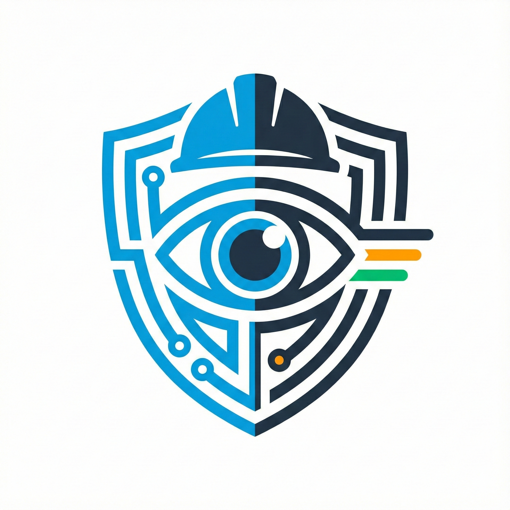

# 🛡️ PPE Safety Monitor
# Final Year Project
# By Hamza Ramzan Muhammad Imran Kashaf Ameen

<div align="center">



**Real-time Personal Protective Equipment Detection & Violation Monitoring System**

[](https://www.python.org/downloads/)
[](https://pypi.org/project/PyQt5/)
[](https://github.com/ultralytics/ultralytics)
[](LICENSE)

[Features](#features) • [Installation](#installation) • [Usage](#usage) • [Docker](#docker-deployment) • [Documentation](#documentation)

</div>

---

## 📋 Overview

PPE Safety Monitor is an advanced computer vision application designed for workplace safety management. It uses state-of-the-art YOLOv11 object detection and StrongSORT tracking to monitor workers in real-time, detecting missing personal protective equipment and sending instant email alerts.

### 🎯 Key Capabilities

- **Real-time Detection**: Monitor multiple video sources simultaneously
- **Violation Tracking**: Track individual workers and their compliance status
- **Automated Alerts**: Email notifications with violation images and reports
- **Multi-Source Support**: Webcam, IP cameras, and video file analysis
- **GPU Acceleration**: CUDA support for high-performance processing
- **Comprehensive Logging**: Detailed violation records with exportable reports

---

## 📸 Screenshots

### Login Screen
Enter Register Email And Password OR Create Register New Account

<div align="center">
  
  <p><i>Enter Your Login Details To Access The App</i></p>
</div>

---
### Connection Screen
Select your video source and configure detection settings.

<div align="center">
  
  <p><i>Choose between Webcam, Video File, or IP Camera with model selection</i></p>
</div>

---

### Monitor Screen - Detection Mode
Real-time object detection with customizable class selection.

<div align="center">
  
  <p><i>Live detection feed with FPS counter and class filtering</i></p>
</div>

---

### Monitor Screen - Tracking Mode
Advanced multi-person tracking with unique IDs.

<div align="center">
  
  <p><i>Person tracking with persistent IDs across frames</i></p>
</div>

---

### Violation Monitor Screen
Dedicated violation detection interface with real-time alerts.

<div align="center">
  
  <p><i>Violation monitoring with PPE compliance checking</i></p>
</div>

---

### Violation Detection - Active Monitoring
Visual feedback for detected violations with detailed overlays.

<div align="center">
  
  <p><i>Red borders indicate missing PPE with item-by-item breakdown</i></p>
</div>

---

### Compliant Worker Display
Green indicators for workers wearing required PPE.

<div align="center">
  
  <p><i>Visual confirmation of PPE compliance</i></p>
</div>

---

### Email Alert System
Professional HTML email alerts with violation details.

<div align="center">
  
  <p><i>Automated email notifications with images and severity levels</i></p>
</div>

---

### Alert Configuration
Easy-to-use interface for configuring email notifications.

<div align="center">
  
  <p><i>SMTP configuration with test functionality</i></p>
</div>

---

### System Logs Panel
Comprehensive logging with filtering and export capabilities.

<div align="center">
  
  <p><i>Real-time logs with violation tracking and statistics</i></p>
</div>

---

### Full Monitor Mode
All-in-one monitoring with detection, tracking, and violation alerts.

<div align="center">
  
  <p><i>Comprehensive safety monitoring dashboard</i></p>
</div>

---

## ✨ Features

### 🔍 Detection & Tracking
- **YOLOv11 Integration**: Industry-leading object detection accuracy
- **StrongSORT Tracking**: Persistent tracking of individuals across frames
- **Custom Model Support**: Load your own trained YOLO models
- **Class Selection**: Choose which PPE items to monitor
- **Confidence Thresholds**: Adjustable detection sensitivity

### 📊 Violation Management
- **Real-time Monitoring**: Instant violation detection and display
- **Batch Processing**: Handle multiple violations simultaneously
- **Severity Classification**: Automatic categorization (LOW/MEDIUM/HIGH/CRITICAL)
- **Visual Feedback**: Color-coded violation indicators
- **Data Storage**: Automatic capture of violation images and metadata

### 📧 Alert System
- **Email Notifications**: Professional HTML email alerts
- **Image Attachments**: Full scene + cropped person images
- **Throttling Controls**: Prevent alert spam with configurable intervals
- **Batch Alerts**: Single email for multiple simultaneous violations
- **SMTP Configuration**: Compatible with Gmail, Outlook, and custom servers

### 💾 Recording & Export
- **Video Recording**: Save detection feeds as MP4 files
- **Frame Capture**: Individual frame extraction
- **Full Monitor Mode**: Automated recording + violation detection
- **Report Generation**: Exportable violation summaries
- **Statistics Dashboard**: Track compliance metrics

### 🎨 Modern UI
- **Dark Theme**: Professional, eye-friendly interface
- **Multi-Screen Layout**: Monitor + Violation screens
- **Real-time FPS Counter**: Performance monitoring
- **Responsive Design**: Adapts to different screen sizes
- **Class Selection Panel**: Intuitive PPE item management

---

## 🔧 Requirements

### System Requirements
- **OS**: Windows 10/11, Linux (Ubuntu 20.04+), macOS 10.15+
- **RAM**: 8GB minimum (16GB recommended)
- **GPU**: NVIDIA GPU with CUDA support (optional but recommended)
- **Storage**: 2GB+ free space

### Software Dependencies
```
Python 3.8+
CUDA 11.8+ (for GPU acceleration)
```

---

## 📦 Installation

### 1. Clone Repository
```bash
git clone https://github.com/yourusername/ppe-safety-monitor.git
cd ppe-safety-monitor
```

### 2. Create Virtual Environment
```bash
# Windows
python -m venv venv
venv\Scripts\activate

# Linux/macOS
python3 -m venv venv
source venv/bin/activate
```

### 3. Install Dependencies
```bash
pip install -r requirements.txt
```

### 4. Install PyTorch (GPU Support)
```bash
# CUDA 11.8
pip install torch torchvision torchaudio --index-url https://download.pytorch.org/whl/cu118

# CUDA 12.1
pip install torch torchvision torchaudio --index-url https://download.pytorch.org/whl/cu121

# CPU Only
pip install torch torchvision torchaudio
```

### 5. Setup Environment Variables
Create a `.env` file in the project root:
```env
SUPABASE_URL=your_supabase_project_url
SUPABASE_KEY=your_supabase_anon_key
```

### 6. Download Models
Place your YOLO model files in the project directory:
- `epoch31.pt` (detection model)
- `osnet_ain_x1_0_market1501_256x128_amsgrad_ep100_lr0.0015_coslr_b64_fb10_softmax_labsmth_flip_jitter.pth` (tracking model)

---

## 🚀 Usage

### Starting the Application
```bash
python app.py
```

### Basic Workflow

#### 1. **Connection Screen**
- Choose video source (Webcam/Video File/IP Camera)
- Select detection model
- Select tracking model
- Enable GPU acceleration (if available)
- Click "Activate Camera"

#### 2. **Monitor Screen**
- **Detection Mode**: Basic object detection
- **Tracking Mode**: Person tracking with IDs
- **Full Monitor**: Detection + Tracking + Recording + Violations
- Select classes to detect in the left panel
- Configure recording settings

#### 3. **Violation Screen**
- Select required PPE items
- Click "Update Violation Classes"
- Start violation detection
- Configure email alerts
- Monitor violations in real-time

### Configuration

#### Email Alerts
1. Click "⚙️ Configure Alerts"
2. Enter SMTP server details:
   ```
   SMTP Server: smtp.gmail.com
   Port: 587
   Sender Email: your.email@gmail.com
   App Password: your_app_password
   Recipients: recipient1@example.com, recipient2@example.com
   ```
3. Test connection
4. Enable alerts

#### Alert Throttling
1. Click "⏱️ Throttle Settings"
2. Set minimum interval between alerts (default: 15 minutes)
3. View throttling statistics
4. Reset throttle timers if needed

#### Recording
1. Click "Start Recording"
2. Choose format (Video/Frames)
3. Select save location
4. Recording starts automatically

---

## 🐳 Docker Deployment

See [DOCKER.md](DOCKER.md) for detailed Docker setup instructions.

Quick start:
```bash
docker build -t ppe-safety-monitor .
docker run -it --rm -e DISPLAY=host.docker.internal:0.0 ppe-safety-monitor
```

---

## 📖 Documentation

### Project Structure
```
ppe-safety-monitor/
├── app.py                 # Main application entry point
├── auth_manager.py        # Supabase authentication
├── objecttracking.py      # Backend detection & tracking
├── ipcamera.py           # IP camera simulation server
├── requirements.txt       # Python dependencies
├── .env                  # Environment variables (not in git)
├── PPE.png               # Application icon
├── epoch31.pt            # YOLO detection model
└── tracking_models/
    └── osnet_*.pth       # Tracking model
```

### Key Classes

#### `MainWindow`
Main application window managing screen navigation.

#### `MonitorScreen`
Real-time detection and tracking display with class selection.

#### `ViolationScreen`
Violation monitoring with alert system and data management.

#### `VideoThread`
Background thread handling video processing and frame callbacks.

#### `AlertManager`
Email alert system with throttling and batch notifications.

#### `ViolationDataManager`
Storage and management of violation data (images + metadata).

---

## 🛠️ Troubleshooting

### GPU Not Detected
```bash
# Verify CUDA installation
nvidia-smi

# Check PyTorch CUDA availability
python -c "import torch; print(torch.cuda.is_available())"
```

### Email Alerts Not Working
- Use App Passwords for Gmail (not regular password)
- Enable "Less Secure Apps" or use OAuth2
- Check firewall settings for port 587

### Camera Connection Failed
- Verify camera URL format: `http://192.168.1.100:8080/video`
- Check network connectivity
- Ensure camera is streaming

### Low FPS Performance
- Enable GPU acceleration
- Reduce video resolution
- Close unnecessary applications
- Check CUDA drivers

---

## 📊 Features Roadmap

- [ ] Multi-camera support
- [ ] Cloud storage integration
- [ ] Mobile app companion
- [ ] Advanced analytics dashboard
- [ ] Custom model training interface
- [ ] WebRTC streaming support

---

## 🤝 Contributing

Contributions are welcome! Please follow these steps:

1. Fork the repository
2. Create a feature branch (`git checkout -b feature/AmazingFeature`)
3. Commit changes (`git commit -m 'Add AmazingFeature'`)
4. Push to branch (`git push origin feature/AmazingFeature`)
5. Open a Pull Request

---

## 📄 License

This project is licensed under the MIT License - see the [LICENSE](LICENSE) file for details.

---

## 🙏 Acknowledgments

- [Ultralytics YOLOv11](https://github.com/ultralytics/ultralytics) - Object detection
- [BoxMOT](https://github.com/mikel-brostrom/yolo_tracking) - Multi-object tracking
- [PyQt5](https://www.riverbankcomputing.com/software/pyqt/) - GUI framework
- [Supabase](https://supabase.com/) - Authentication backend

---

## 📞 Support

- 📧 Email: hamza.jani7433@gmail.com
- 🐛 Issues: [GitHub Issues](https://github.com/yourusername/ppe-safety-monitor/issues)
- 📖 Documentation: [Wiki](https://github.com/yourusername/ppe-safety-monitor/wiki)

---

## 📚 Additional Documentation

- **[DOCKER.md](DOCKER.md)** - Complete Docker deployment guide
- **[CONTRIBUTING.md](CONTRIBUTING.md)** - Contribution guidelines
- **[SCREENSHOTS_GUIDE.md](SCREENSHOTS_GUIDE.md)** - How to capture screenshots
- **[SCREENSHOT_CHECKLIST.md](SCREENSHOT_CHECKLIST.md)** - Quick screenshot reference
- **[GALLERY.md](GALLERY.md)** - Alternative screenshot gallery layout

### Quick Setup Scripts
```bash
# Setup project
./setup.sh              # Linux/macOS
setup.bat               # Windows

# Setup screenshots folder
./setup_screenshots.sh  # Linux/macOS
setup_screenshots.bat   # Windows

# Verify screenshots
./verify_screenshots.sh # Linux/macOS
verify_screenshots.bat  # Windows
```

---

<div align="center">

**Made with ❤️ for Workplace Safety**

⭐ Star this repository if you find it helpful!

</div>
